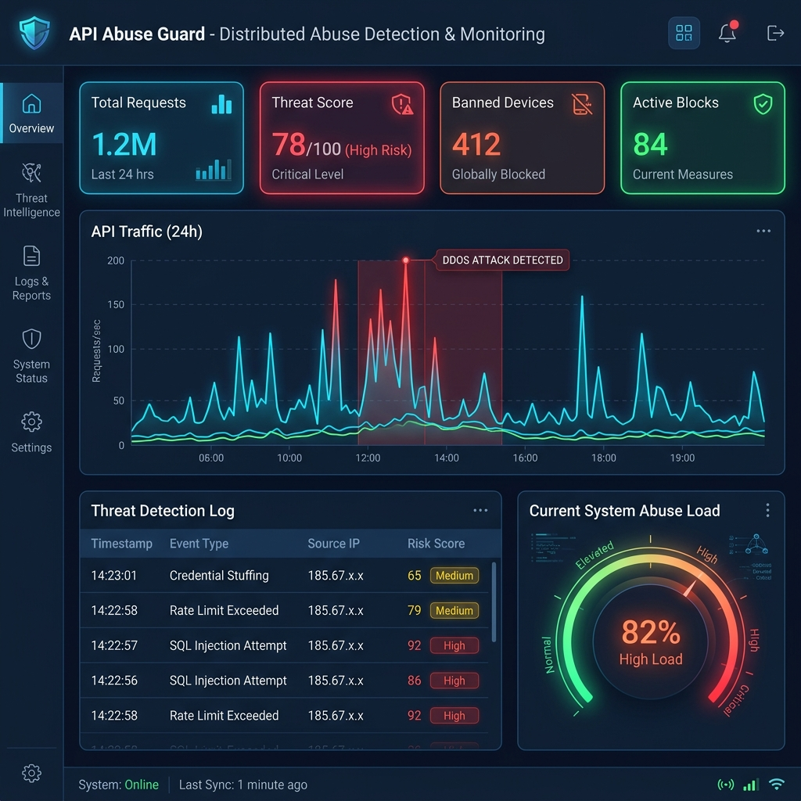
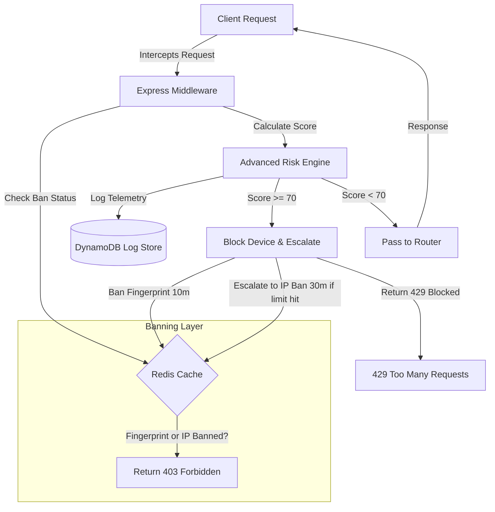
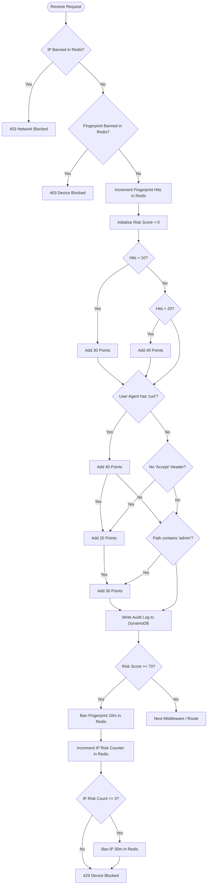

# 🛡️ API Abuse Guard

[](https://nodejs.org/)
[](https://expressjs.com/)
[](https://redis.io/)
[](https://aws.amazon.com/dynamodb/)
[](LICENSE)

**API Abuse Guard** is a highly efficient, distributed abuse detection and real-time monitoring system. It intercepts client requests using Express middleware to analyze risks, perform device fingerprinting, track request velocities in Redis, and persist long-term access logs in AWS DynamoDB. The system automatically quarantines abusive devices and escalates to network-level IP bans during distributed attacks.

---

## 🖥️ Live Monitoring Dashboard Visualization

The system compiles telemetry metrics and attack signatures into a centralized security dashboard for network operators:



---

## 🕹️ Interactive HLD & Threat Simulator

The system includes an interactive, animated HTML5 High-Level Design (HLD) map and simulator console served directly at the server root:

* **Motion Flow Animations**: Connectors highlight request packets traveling dynamically between nodes (Client → Middleware → Redis → DynamoDB → Router).
* **Custom Threat Generator**: Test headers, request speeds (velocity), and path vulnerabilities to observe active defensive score adjustments and ban actions (allow 200, block 429, or network ban 403).

To launch the interactive simulator, run the server and navigate to `http://localhost:3000/`.

---

## 🚀 Key Features

* **⚙️ Advanced Multi-Dimensional Risk Engine**: Dynamically calculates risk scores based on request rate, specific user agents, missing request headers, and sensitive route scanning.
* **🔑 Device Fingerprinting**: Employs SHA-256 fingerprinting based on headers (`User-Agent`, `Accept-Language`, `Accept-Encoding`, `sec-ch-ua`, etc.) and client IP, rendering simple IP-rotation bot attacks ineffective.
* **⚡ Two-Tier Redis Ban Escalation**:
  1. **Fingerprint Ban**: Temporary restriction (10 mins) on a specific device fingerprint showing malicious patterns.
  2. **IP Network Ban**: Automatic escalation to a full IP-level ban (30 mins) if multiple devices or spoofed fingerprinted requests originate from the same IP network.
* **📊 DynamoDB Analytics Store**: Offloads request payloads, fingerprints, and calculated risk scores asynchronously to AWS DynamoDB for compliance, reporting, and audit trails.
* **📈 Monitoring & Health Endpoints**: Dedicated routes to query global traffic statistics, top abusive IPs, active ban lists, and live cache status.

---

## 🏗️ System Architecture

The workflow below illustrates how incoming API traffic is evaluated, audited, and cached in real time.



---

## 🧠 Risk Scoring & Decision Engine

The following diagram maps the step-by-step decision matrix applied to each client request:



---

## 🛠️ Configuration & API Reference

<details>
<summary><b>📋 Environment Variables</b></summary>

The application configures itself using local environment settings:

| Variable | Type | Default | Description |
| :--- | :--- | :--- | :--- |
| `PORT` | Number | `3000` | Port for the Express server to listen on. |
| `REDIS_HOST` | String | `redis` | Redis service host address. |
| `AWS_REGION` | String | `ap-south-1` | Target AWS region for DynamoDB client. |
| `AWS_ACCESS_KEY_ID` | String | *Optional* | Credential for AWS. |
| `AWS_SECRET_ACCESS_KEY` | String | *Optional* | Credential for AWS. |

</details>

<details>
<summary><b>🔌 Dashboard API Endpoints</b></summary>

### 1. Health Status
Verify the system status and Redis connectivity.
* **URL:** `/health`
* **Method:** `GET`
* **Response Sample (200 OK):**
  ```json
  {
    "status": "ok",
    "redis": "connected"
  }
  ```

### 2. Overview Telemetry
Get statistics on traffic and current threat classifications.
* **URL:** `/api/dashboard/overview`
* **Method:** `GET`
* **Response Sample (200 OK):**
  ```json
  {
    "totalRequests": 12430,
    "uniqueIPs": 412,
    "highRisk": 84,
    "recent": [
      {
        "ipAddress": "198.51.100.42",
        "timestamp": "2026-07-07T15:30:11.231Z",
        "fingerprint": "a4d3e8f812b10acbdc87fa98...",
        "hits": "15",
        "riskScore": "70",
        "path": "/api/v1/admin/login",
        "userAgent": "curl/7.81.0"
      }
    ]
  }
  ```

### 3. Top Abusive IPs
List the most active client IPs requesting resources.
* **URL:** `/api/dashboard/top-ips`
* **Method:** `GET`
* **Response Sample (200 OK):**
  ```json
  [
    ["198.51.100.42", 1250],
    ["203.0.113.88", 840],
    ["192.0.2.15", 320]
  ]
  ```

### 4. Active Banned Entities
Get list of blocked IP addresses and Fingerprints.
* **URL:** `/api/dashboard/banned-ips`
* **Method:** `GET`
* **Response Sample (200 OK):**
  ```json
  {
    "ipBanCount": 2,
    "fingerprintBanCount": 5,
    "ipBans": ["198.51.100.42", "203.0.113.88"],
    "fingerprintBans": [
      "a4d3e8f812b10acbdc87fa98",
      "b2c4d9e011f20accdc34fa22"
    ]
  }
  ```

</details>

<details>
<summary><b>📦 Installation & Getting Started</b></summary>

### Prerequisites
Make sure you have [Node.js (v20+)](https://nodejs.org/), [Redis](https://redis.io/), and an configured [AWS DynamoDB Table](https://aws.amazon.com/dynamodb/) named `api-request-logs`.

### Local Setup
1. **Clone the repository:**
   ```bash
   git clone https://github.com/Mohamed-hazin5/api-abuse-guard.git
   cd api-abuse-guard
   ```

2. **Install dependencies:**
   ```bash
   npm install
   ```

3. **Configure AWS & Redis hosts:**
   Make sure Redis is running locally, or export `REDIS_HOST`:
   ```bash
   export REDIS_HOST="127.0.0.1"
   ```

4. **Start the application:**
   ```bash
   node server.js
   ```

### Running with Docker
A `Dockerfile` is included in the project for easy virtualization.

1. **Build the container:**
   ```bash
   docker build -t api-abuse-guard .
   ```

2. **Run container with Redis link:**
   ```bash
   docker run -d --name my-redis-server redis:alpine
   docker run -d -p 3000:3000 --name abuse-guard --link my-redis-server:redis -e REDIS_HOST="redis" api-abuse-guard
   ```

</details>

---

## 🔒 License
This project is licensed under the **ISC License**. See the `package.json` file for details.
